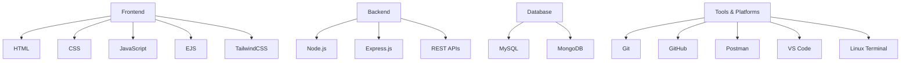

# 💼 Aniket Thapa

**Backend Developer | Node.js Specialist | API Designer**  
📍 India | 📧 aniketthapa.dev@gmail.com | 📞 +91 9103315277  
🔗 [LinkedIn](https://linkedin.com/in/aniket-thapa) • [GitHub](https://github.com/aniket-thapa)

---

## 🔹 Summary

Dedicated and performance-driven IT undergraduate with a passion for crafting scalable, secure, and efficient web applications. With a strong foundation in **Node.js**, **Express**, **MySQL**, and **MongoDB**, I specialize in designing clean RESTful APIs, database-driven systems, and full-stack web platforms. I enjoy working on meaningful projects that solve real-world problems and believe in continuous self-improvement through hands-on experience and exploration.

---

## 🛠️ Tech Stack



---

## 💼 Experience

### 🧑‍💻 Full Stack Development Intern

**University of Jammu – PG Dept. of Computer Science & IT**
📅 *June 2024 – July 2024*

* Developed a full-stack **Alumni Management & Transcript Generation System**.
* Engineered backend logic using **Node.js** and **MySQL** with robust session and file management.
* Delivered a clean and accessible admin interface using **EJS** and **TailwindCSS**.
* Liaised with university faculty to tailor functionality to academic workflows.

---

## 🚀 Projects

### 🎓 [Alumni Management & Transcript System](https://github.com/aniket-thapa/alumni-management-and-transcript-generation-system)

**Stack**: Node.js, Express, MySQL, Multer, EJS, Axios

> End-to-end platform for handling alumni records and transcript processing.

* Secure login/session management and dynamic rendering.
* Supports document upload, PDF generation, and role-based access.

---

### 📚 [Library Management System](https://github.com/aniket-thapa/library-management-system)

**Stack**: Node.js, Express, MySQL

> Backend-focused project for managing books and users.

* Integrated admin control for issuing/returning books.
* Efficient data modeling and RESTful routes.

---

### 📝 [Blogging Platform](https://github.com/aniket-thapa/blogging-platform)

**Stack**: Node.js, MongoDB, Google OAuth

> A minimalist blog system with authentication and post routing.

* Google OAuth integration.
* Clean session-based login and blog rendering via EJS.

---

### ✅ [Task Management API](https://github.com/aniket-thapa/task-management-api)

**Stack**: Node.js, Express, MySQL

> Lightweight but secure task creation and tracking API.

* JWT-authenticated endpoints with CRUD operations.
* Clear and modular route design.

---

## 📜 Certifications

* 🏅 **JavaScript Essentials 1** – Cisco Networking Academy
  🔗 [Credly Certificate](https://www.credly.com/badges/fcb58e2b-e598-401e-99b1-5e64f43c53bc)

* 💻 **Web Development Basics** – PhysicsWallah
  🔗 [Certificate](https://pwskills.com/learn/certificate/522bf2b8-e5b0-402d-8bc9-cb0b7732dc5b)

* 🔧 **Backend Development** – PhysicsWallah
  🔗 [Certificate](https://pwskills.com/learn/certificate/37626c8b-f0cf-4188-839e-b362a05476fd)

---

## 🎓 Education

**B.E. in Information Technology**
📍 MBM University, Jodhpur
🗓️ *2022 – Present* | 🎯 GPA: 8.76
Courses: DBMS, Operating Systems, CN, DSA, OOP, Software Engineering, AI/ML, NLP

**Class 12 – State Board**
📅 2021 – 2022 | 📊 83.2%

**Class 10 – State Board**
📅 2019 – 2020 | 📊 86%

---

## 💡 Tech Philosophy

> "I believe great software is built with **clarity**, **security**, and **scalability** in mind. I focus on writing clean, maintainable code that’s easy for teams to build on and users to trust."

---

## 🧠 Soft Skills

* 🔍 Strong analytical thinking and debugging skills.
* 🤝 Effective communicator in collaborative, fast-paced teams.
* 🕒 Time management champion — consistent with deadlines and goals.
* 🌱 Growth-oriented — committed to lifelong learning.
* 🧼 Code hygiene enthusiast — modular, readable, and DRY.

---

## 🔗 Links

* 📁 [Alumni Management System Repo](https://github.com/aniket-thapa/alumni-management-and-transcript-generation-system)
* 📁 [Library Management System Repo](https://github.com/aniket-thapa/library-management-system)
* 📁 [Blogging Platform Repo](https://github.com/aniket-thapa/blogging-platform)
* 📁 [Task Management API Repo](https://github.com/aniket-thapa/task-management-api)

```
